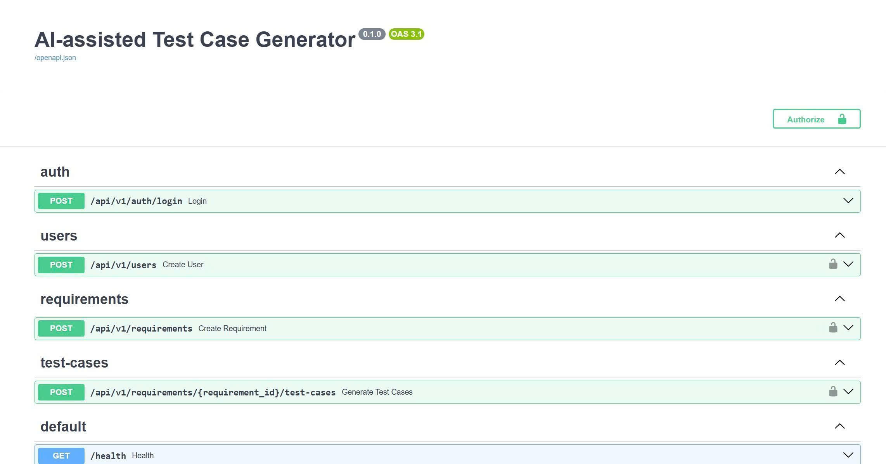

# Công cụ sinh test case tự động từ đặc tả yêu cầu bằng AI

Đồ án ngành ITEC4401 - Đề tài #13. Stack: Next.js 16 + TypeScript, FastAPI + Python, PostgreSQL + pgvector, OpenAI API, Celery và RabbitMQ.

## Kiến trúc

- Source nằm trong `src/`, tách `frontend/` và `backend/` (AR-01).
- Backend feature-based; Router -> Service -> Repository (AR-02, AR-03, AR-08).
- OpenAI/Embedding adapter nằm tại `src/backend/app/common/ai/` (AR-11).
- Business Rule được gắn mã BR tại Service khi có logic nghiệp vụ (DC-03).
- AI generation chạy background job qua Celery + RabbitMQ; HTTP submit trả `202 Accepted`.

## Yêu cầu môi trường

- Python 3.11+
- Node.js 20.9+ (khuyến nghị Node 22 LTS)
- PostgreSQL 15+ với pgvector
- RabbitMQ 4+
- npm 10+

## Chạy nhanh

1. Copy `.env.example` thành `.env` và thay các giá trị local. Không commit `.env`.
2. Backend: `pip install -r src/backend/requirements.txt`
3. Database: `alembic -c src/backend/alembic.ini upgrade head && python src/backend/scripts/seed_demo.py`
4. Backend: `uvicorn app.main:app --reload --app-dir src/backend`
5. Worker: `celery -A app.worker.celery_app worker --loglevel=INFO --pool=solo --workdir=src/backend`
6. Frontend: `cd src/frontend && npm install && copy .env.example .env.local && npm run dev`

Mở `http://localhost:3000`; Swagger ở `http://localhost:8000/docs`.

## Frontend Tuần 07

Frontend có các workspace theo role:

- Login và lưu Bearer token local.
- QA: nhập/cập nhật Requirement, submit AI generation, theo dõi Generation Job.
- QA/Manager: danh sách Test Case, edit, review, approve, request-fix, reject.
- Duplicate candidate bằng pgvector và lịch sử version/compare/restore.
- Manager: module, tags và coverage/statistics.
- QA/Manager: export CSV/XLSX các Test Case `APPROVED`; sau export thành công các Test Case đã xuất chuyển sang `EXPORTED`.
- Admin: tạo/list/cập nhật/vô hiệu hóa User và quản lý versioned Prompt/Model configuration.

Các màn hình có trạng thái loading, empty và error để đáp ứng FE-03.

## Kiểm thử và chất lượng

Backend, từ root repo:

```bash
ruff format --check src/backend
ruff check src/backend
pytest
pytest --cov=app --cov-report=term-missing
```

Frontend:

```bash
cd src/frontend
npm run format:check
npm run lint
npm run build
```

GitHub Actions chạy cả backend và frontend khi push lên `tuan-07` và khi mở PR vào `main`.

## pgvector / NC-05

- Embedding model mặc định: `text-embedding-3-small`.
- Dimensions: `1536`.
- Similarity threshold: `0.85`.
- Index: HNSW với cosine distance.
- Rebuild toàn bộ embedding: `PYTHONPATH=src/backend python src/backend/scripts/rebuild_embeddings.py --batch-size 50`.

Chi tiết cài đặt backend: `src/backend/README.md`.

## Tài khoản demo local

Sau khi seed:

- Admin: `admin@example.com`
- Manager: `manager@example.com`
- QA: `qa@example.com`
- Password: giá trị `DEMO_USER_PASSWORD` trong `.env`.

## Tài liệu tiến độ

- `docs/weekly/Tuan07.md`
- `docs/kiem-thu/TC-TUAN07.md`
- `docs/kiem-thu/matran-truyvet.md`
- `docs/kiem-thu/tuan07.http`

## Nguồn tham khảo / AI hỗ trợ

Các phần có AI hỗ trợ được ghi chú theo AI-05 trong source. Người nộp chịu trách nhiệm đọc, kiểm thử và giải thích được code khi bảo vệ.

## Screenshot

Ảnh minh họa API và kết quả chạy của hệ thống:



Các ảnh kiểm thử và minh chứng khác được lưu trong `docs/assets/`.
